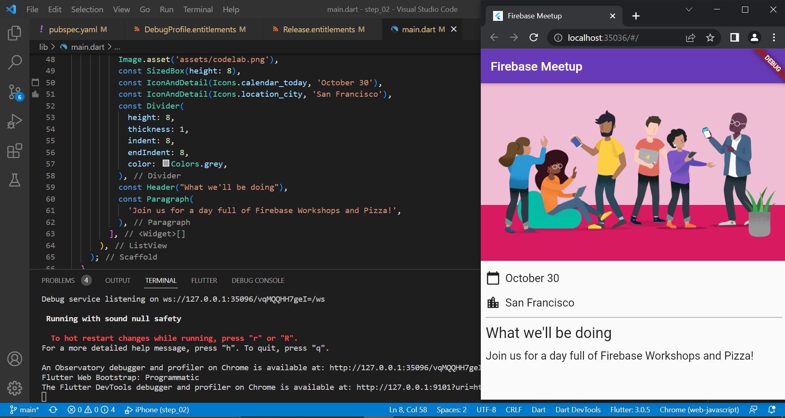
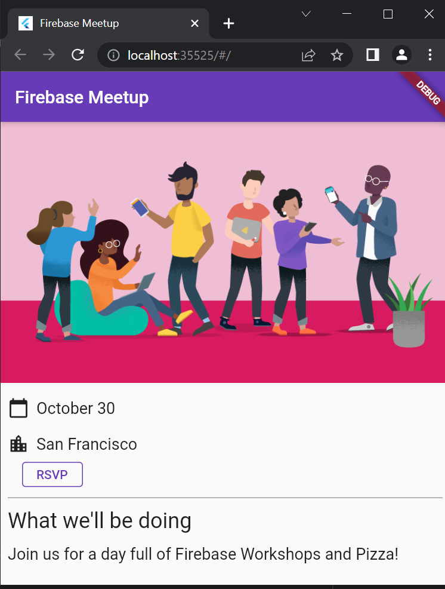
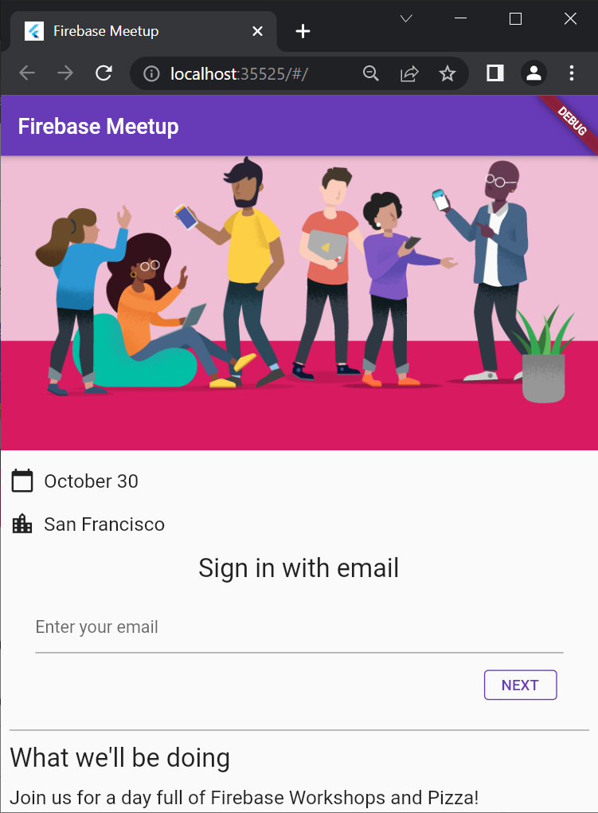
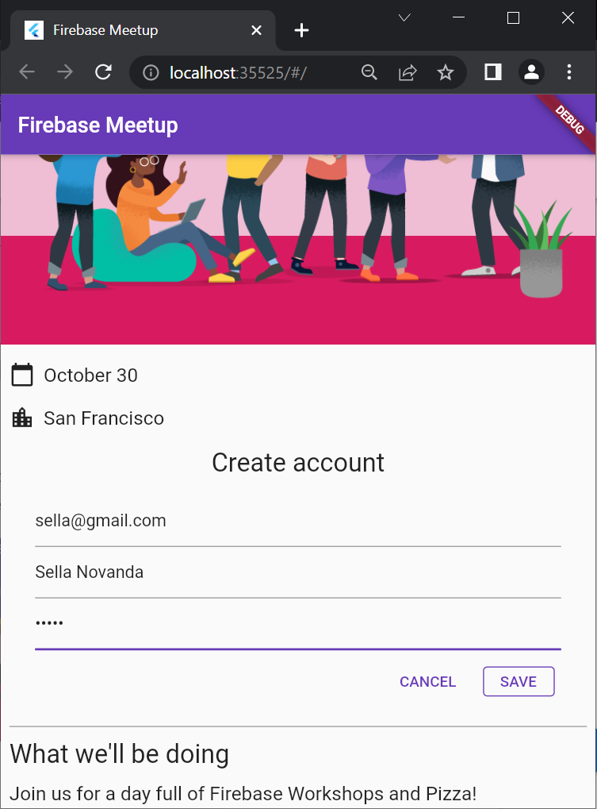
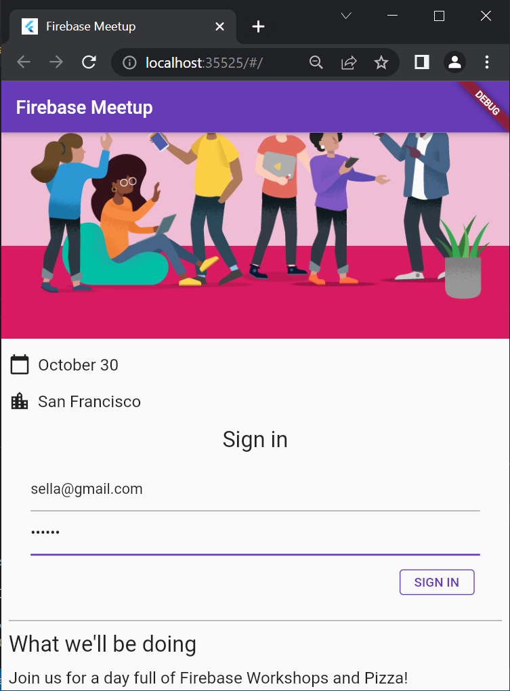
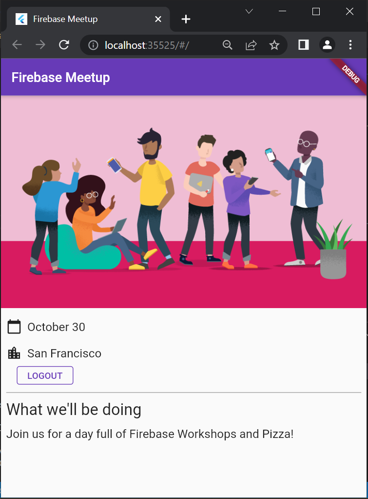

# firebase_flutter

## Clone Project

## Menguji Alur Otentikasi

Berikut adalah awal dari alur otentikasi, di mana pengguna dapat menekan tombol RSVP, untuk memulai formulir email.

Setelah memasukkan email, sistem mengkonfirmasi jika pengguna sudah terdaftar, dalam hal ini pengguna dimintai kata sandi, atau jika pengguna tidak terdaftar, maka mereka pergi melalui formulir pendaftaran.

Pastikan untuk mencoba memasukkan kata sandi pendek (kurang dari enam karakter) untuk memeriksa alur penanganan kesalahan. Jika pengguna terdaftar, mereka akan melihat kata sandi sebagai gantinya.

Pada halaman ini pastikan untuk memasukkan password yang salah untuk memeriksa penanganan error pada halaman ini. Terakhir, setelah pengguna masuk, Anda akan melihat pengalaman masuk yang menawarkan pengguna kemampuan untuk keluar lagi.

